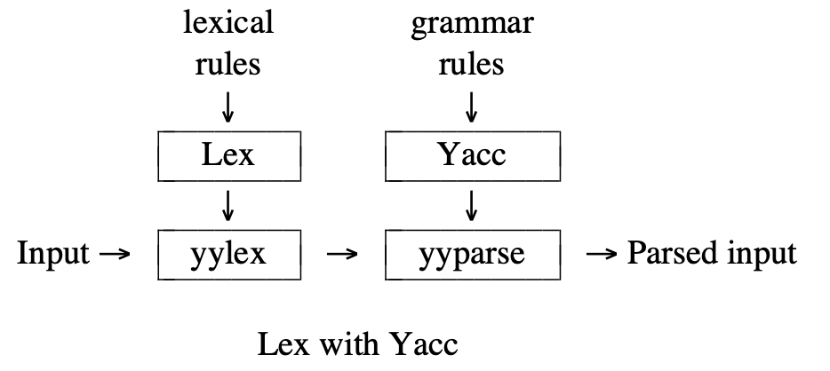

# CS143-PA2: Lexical analyzer (scanner)
本文主要记录cs143的第一次assignment，内容是根据已有框架，利用``lexical analyzer generator``，在c++中这个工具叫``flex``，手写一个``lexical analyzer``。在这个课程中总共有4个作业，依次是完成``lexical analysis``, ``parsing``, ``semantic analysis``和``code generation``，分别是编译器的四个不同阶段，这个作业正好对应第一个阶段。

## COOL Language
``Cool``是在本课程中使用一种编程语言，有自己的语法，相对而言比较简单。它的文档在``cool_manual.pdf``中。

## Flex
``flex``(快速词法分析产生器，英语：fast lexical analyze generator)是一种词法分析程序。它是``lex``开源版本，以BSD许可证放出。``Lex``代表Lexical Analyzer，是一种生成扫描器的工具，可以识别文本中的词汇模式。``Lex``于``C``是强耦合的，一个``.l``文件通过共用的``Lex``程序来传递，并生``C``的输出文件。这些文件被编译为词法分析器的可执行版本。``Lex``把每个扫描出来的单词叫做``token``，它可以有很多的类。对比自然语言的话，英语中的每个单词都是``token``，noun（名词）是一个类``token``，apple就是属于这个类型的一个具体``token``。对于某个编程语言来说，``token``的个数是很有限的。``Lex``工具会帮我们生成一个``yylex``函数，``yacc``通过调用这个函数来得知拿到的``token``是什么类型的，其中``token``的类型是在``yacc``中定义的。``Lex``的输入文件一般会被命名成``xx.l``文件，其输出文件是``lex.yy.c``。[<sup>1</sup>](#refer-anchor)

下图直观地描述了``Lex``的输入和输出:


### yacc
上面提到了``yacc``，在这里简单介绍一下。``yacc``（Yet Another Compiler Compiler），是Unix/Linux上一个用来生成编译器的编译器（编译器代码生成器）。``yacc``生成的编译器主要是用C语言写成的词法分析器（Parser），需要与词法分析器``Lex``一起使用，再把两部份产生出来的C程序一并编译。下图说明两者之间的关系：


回到本次作业中，为了编译``COOL``程序，我们需要``定义``这个编程语言的``语法``，而该``语法``是在一定的规则和框架下制定的。简而言之，就是使用``Lex``来编写``语法``，然后``Lex``会将我们编写好的``语法``处理成特定的文件，最后输入``yacc``。这个``语法``就是``Lex``中的rules。

在``Lex``中rules file的结构如下所示:
```
%{
Declarations
%}
Definitions
%%
Rules
%%
User subroutines
```
其中最主要的是``Rules``部分，其他两部份是可选的，它的格式如下：
```
pattern {action}
```
``pattern``是正则表达式，大括号中的``action``是用C写的代码。因为认为``Lex``已经定义了一套框架，当特定``pattern``匹配成功时，我们需要在``action``中更改指定的变量，并返回指定的值。这些指定值是已经在``Lex``中定义好的，在接下来会进行说明。

### 简单的例子
下面的例子就是这次作业要实现的目标，在这里是使用参考的``reflexer``来实现的。首先是一小段``COOL``的代码：
```
class CellularAutomaton inherits IO {
    population_map : String;
```
通过``flex``后被转化为如下代码：
```
#name "test.cl"
#5 CLASS
#5 TYPEID CellularAutomaton
#5 INHERITS
#5 TYPEID IO
#5 '{'
#6 OBJECTID population_map
#6 ':'
#6 TYPEID String
#6 ';'
```
从中也不难看出``flex``所实现的功能，会对原始代码中的所有字符进行分析归类，包括标点符号，并且在前面也标出了字符串在原有代码中的行号。其实就是原代码中的每个**成分**都被转化成了更高级的**抽象**，以便于下一步的处理。

## 编写cool.flex
在这个实验中，所有需要我完成的内容，都在这个文件内。根据目录下的``Makefile``，在完成编写后，执行``make dotest``，将编译``lexer``，并使用这个``lexer``对``test.cl``进行词法分析。
当然，编译``lexer``可单独通过执行``make lexer``来实现，将一系列c代码编译。其中，``cool-lex.cc``是``flex``通过``cool.flex``生成的，包含了词法分析的主要流程；``lextest.cc``包含``main``入口，主要的命令行输出在这里进行；其余文件都是辅助性代码。

``flex``的作用就是将``.flex``格式的文件转换为``c``代码，并将其结果作为库函数和其他文件一同编译。``lextest.cc``调用了``cool.flex``生成的代码，在之后的``PA``中，调用这个代码的可能是编译器的其他组件。

在``.flex``文件中，我们通过设置**正则表达式**，定义了一些**词汇**``lexeme``，这些词汇将被转化为抽象符号``token``，作为词法分析的结果。一个``flex``文件由3部分组成，每个部分之间用``%%``隔开，在上一个``section``中已有说明。最为重要的是``rules``区，我们在这里写正则表达式。每个正则表达式后跟着一个``{}``定义的代码块，每当这个正则表达式达到匹配，就会执行这个代码块。

### ``Definitions``区
这个部分由两种代码组成，一种是``C``代码，一种是``flex``定义。

要写``C``代码，可以让代码缩进，也可以写在``%{``和``%}``定义的代码块中。后者是``cool.flex``中已有代码选择的方案。第一种方案不太推荐，因为**缩进**容易被忽略。正如``cool.flex``开头的注释中所说，``%{%}``包含的内容，会被原封不动地拷贝到输出文件C代码中。我们要像写真正的C代码一样写``Definitions``区中的C代码。


而``flex``定义是其他内容，不是``C``代码的内容都是``flex``定义。其格式如下：
```
name definition
```
也就是对一个可能重复出现的表达式命名，类似于宏定义，如已有的示例``DARROW =>``，则在``Rules``区中，所有的``DARROW``都被理解为``=>``。我们在这里主要是对``Cool``语言的关键词进行定义，在后面的代码中使用。根据文档中的提示，所有的关键词可以在``cool-parse.h``这个文件中找到。这个区的代码如下所示：
```
DARROW          =>
CLASS           class
ELSE            else
FI              fi
IF              if
IN              in
INHERITS        inherits
LET             let
LOOP            loop
POOL            pool
THEN            then
WHILE           while
CASE            case
ESAC            esac
OF              of
NEW             new
ISVOID          isvoid
ASSIGN          <-
NOT             not
LE              <=
```

### ``Rules``区
这是整个文件的重点，也是必不可少的一部份。在格式上有一些规定，正则表达式在新的一行的开始头写，和行首之间一定没有空格，否则这些空格被当作正则表达式的一部份。其后的代码块和正则表达式之间一定要有空格，否则``{``被当作正则表达式的一部分。

代码块中写的是C代码，根据有没有返回值，代码的欣慰有所不同。由返回值的代码块，被匹配的字符串会被做成一个``token``，并提交给上层代码。无返回值的代码块，执行完代码块后忽略这一段匹配到的字符串，``Cool``语言中的**注释**应该这样处理。

还有一个规则需要注意，写在``flex``中的多行注释在开头应该添加缩进，如下所示：
```c++
    /*
        Type Identifiers
        begin with a capital letter
    */
```
缩进可以是任意个数的空格，但不能是0个。如果不添加缩进，则``/*``和其他行首符可能被当作正则表达式处理。


### 执行``lexer``
阅读文件``lextest.cc``，可以感受``flex``产生的C代码是如何被调用的。
每次调用``cool_yylex``，也就是``yylex``函数，进行了一次匹配尝试，得到一个``token``，且全局变量``cool_yylval``，``curr_lineno``可能在``cool_yylex``执行的时候被修改。``token``，``cool_yylval``，``curr_lineno``就是一次匹配得到的所有信息，分别代表了**匹配了什么语句**，**语句包含了什么额外信息**，**语句在哪一行**，匹配的行为由``cool.flex``中的代码决定。通过函数``dump_cool_token``输出这些信息，就得到上一个``section``的中的例子。

### 语句的种类
词法分析就是识别不同的语句，并进行相应的处理，语句由正则表达式规定，处理由语句后的代码块规定，总的来说，需要我们处理这么几类语句：

- 关键字，组成的字符串是固定的，如``if``，``fi``， ``else``。
- 整数、字符串，需要``lexer``记录额外信息如整数值、字符串内容。
- 注释和空格，应该忽略，不生成``token``。
- 各种符号，类型名``TYPE ID``、变量名``Object ID``。
- 非法字符，如``[``，``]``，``>``等。
- 换行符，应更新表示当前行号的全局变量``curr_lineno``。

具体的``specification``，在``cool_manual.pdf``中的第10节由详细的说明。

词法分析的难点在于完整和正确，要包含代码中所有可能出现的情况，并对所有情况都进行正确处理，好像只能通过和正确词法分析器的大量对比才能判断自己写的是否有出入。

#### 关键字
关键字都是固定字符串，因此可以直接使用全字匹配的模式。所有的关键字都在文件``include/PA2/cool-parse.h``中，定义在``enum yytokentype``枚举类型下。

在``Definitions``区已经对这些关键字进行了定义，然后需要在``Rules``区写匹配的正则表达式：
```c++
{DARROW} { return (DARROW); }
{CLASS} { return (CLASS); }
{ELSE} { return (ELSE); }
{FI} { return (FI); }
{IF} { return (IF); }
{IN} { return (IN); }
{INHERITS} { return (INHERITS); }
{LET} { return (LET); }
{LOOP} { return (LOOP); }
{POOL} { return (POOL); }
{THEN} { return (THEN); }
{WHILE} { return (WHILE); }
{CASE} { return (CASE); }
{ESAC} { return (ESAC); }
{OF} { return (OF); }
{NEW} { return (NEW); }
{ISVOID} { return (ISVOID); }
{ASSIGN} { return (ASSIGN); }
{NOT} { return (NOT); }
{LE} { return (LE); }
```
对应的关键字生成了对应的``token``，非常直观。

#### 整数
整数较为简单，全部由数字组成，``COOL``不支持浮点类型。
```
[0-9][0-9]* {
    cool_yylval.symbol = inttable.add_string(yy_text, yyleng);
    return (ING_CONST);
}
```

#### 字符串
解析字符串较为复杂一点，因为所有的字符串都由``"``符号来触发，因此需要使用**状态量**``Start Condition``记录这个状态。并且，字符串需要处理字符串分行和转义符等等特殊情况。
首先定义接下来要用到的**状态量**：
```
%x STRING
%x STRING_ESCAPE
```
准备一个全局变量，存放读取到的字符串内容:
```
static std::vector<char> stringArray;
```
在初始状态下的引号``"``触发进入``STRING``状态：
```
\" {
    stringCaller = INITIAL;
    stringArray.clear();
    BEGIN(STRING);
}
```
当没有转义符的情况下遇到``"``，字符串读取结束，应该返回:
```
<STRING>[^\"\\]*\" {
    // push back string
    // does not include the last character \"
    stringArray.insert(string.end(), yytext, yytext + yyleng - 1);
    // setup string table
    cool_yylval.symbol = stringtable.add_string(&stringArray[0], stringArray.size());
    // exit
    BEGIN(stringCaller);
    return (STR_CONST);
}
```
若遇见转义符，应进入转义符处理状态:
```
<STRING>[^\"\\]*\\ {
    // does not include the last character escape
    stringArray.insert(stringArray.end(), yytext, yytext + yyleng - 1);
    BEGIN(STRING_ESCAPE);
}
```
少数几个转义符会被真正解析成单个字符：
```
<STRING_ESCAPE>n {
    stringArray.push_back("\n");
    BEGIN(STRING);
}
<STRING_ESCAPE>b {
    stringArray.push_back("\b");
    BEGIN(STRING);
}
<STRING_ESCAPE>t {
    stringArray.push_back("\t");
    BEGIN(STRING);
}
<STRING_ESCAPE>f {
    stringArray.push_back("\f");
    BEGIN(STRING);
}
```
其余在``\``后的字符被解析成字符本身：
```
<STRING_ESCAPE>. {
    stringArray.push_back(yytext[0]);
    BEGIN(STRING);
}
```
特别的，转义符``\``后是换行符``\n``，应作换行符处理:
```
<STRING_ESCAPE>\n {
    stringArray.push_back('\n');
    ++curr_lineno;
    BEGIN(STRING);
}
```
字面量中出现终止符``\0``应作错误处理：
```
<STRING_ESCAPE>0 {
    cool_yylval.error_msg = "String contains null character";
    BEGIN(STRING);
    return (ERROR);
}
```
字面量行尾无转义符、无引号``"``，字符串前后引号不匹配，作错误处理：
```
<STRING>[^\"\\]*$ {
    // push first
    // contains the last character for yytext does not include \n
    stringArray.insert(stringArray.end(), yytext, yytext + yyleng);
    // setup error later
    cool_yylval.error_msg = "Unterminated string constant";
    BEGIN(stringCaller);
    ++curr_lineno;
    return (ERROR);
}
```
出现``EOF``应作错误处理：
```
<STRING_ESCAPE><<EOF>> {
    cool_yylval.error_msg = "EOF in string constant";
    BEGIN(STRING);
    return (ERROR);
}
<STRING><<EOF>> {
    cool_yylval.error_msg = "EOF in string constant";
    BEGIN(stringCaller);
    return (ERROR);
}
```
#### 单个的合法字符和非法字符
同其他编程语言一样，``Cool``也接受一些单个字符。有余接受的合法字符很多，非法字符占少数，故使用``.``匹配所有字符，并将非法字符单独列出。

非法字符如下:
```
[\[\]\'>] {
    cool_yylval.error_msg = yytext;
    return (ERROR);
}
```

合法字符可以直接返回字符本身的ASCII码：
```
. {
    return yytext[0];
}
```

由于正则表达式``.``可能在很多情况下发生匹配，最好将它放在``cool.flex``靠后的位置。根据``flex``的语法规则，如果发生多个匹配，以第一个为准。

一些代表空格的字符应该被忽略，由于他们的处理代码块相同，我们就把他们写在一起：
```
[ \t\f\r\v] {}
```
注意第一个是个空格， 不能省略这个空格，因为空格也是一个需要被忽略的字符。

还有一个特别的单个字符，就是换行``\n``，这个字符应该令当前的行数+1:
```
\n { ++curr_lineno; }
```

#### 单行注释
单行注释可以直接被一个简单的正则表达式匹配，不需要额外复杂的操作。
```
--.*$ {}
```
整个正则表达式匹配一个以``--``开头的字符串，匹配至当前行的结尾，中间可以为任意数量的任意字符。末尾的``$``可省略，因为``.*``匹配换行符，写在这里是避免歧义。
注意，这里不需要``++curr_lineno``，因为这个正则表达式没有匹配换行符，注释后的换行符会被马上匹配。

#### 多行注释
处理多行注释和字符串时，我们需要**状态量**``Start Condition``，这是``flex``提供的语法糖，为我们提供相应的方便。

这里首先说明一下``Start Condition``语法糖的一些比较基本的用法。正则表达式之前写尖括号``<>``，其中写一个**状态量**，当这个状态量成立时，这个正则表达式才会被匹配。要使一个状态量成立，我们只需要在一个代码块中写``BEGIN(...)``。状态量使用之前需要在``Definitions``区声明，如下所示：
```
%x COMMENT
```
我们还用了一个全局变量，表示多行注释处理完成后，应该返回什么状态量，也写在``Definitions``区。
```
static int commentCaller；
```
``flex``中定义了一个初始化状态量``INITIAL``，它也是``int``类型，值为0。当执行``BEGIN(INITIAL)``或者``BEGIN(0)``后，所有的状态量都会失效，也即默认没有状态量的语句才会生效。

多行注释由``(*``触发：
```
"(*" {
    commentCaller = INITIAL;
    BEGIN(COMMENT);
}
```
多行注释结束之后应该恢复初始状态量：
```
<COMMENT>"*)" {
    BEGIN(commentCaller);
}
```

当状态量不是``COMMENT``的时候，若找到``*)``，说明有错误：
```
\*\) {
    cool_yylval.error_msg = "Unmatched *)";
    return (ERROR);
}
```
对于多行注释中的每个字符，都不生成``token``，遇到换行则需要将表示当前行的全局变量递增：
```
<COMMENT>[^(\*\))] {
    if (yytext[0] == '\n') {
        ++curr_lineno;
    }
}
```
在多行注释中看到``EOF``，说明有语法错误：
```
<COMMENT><<EOF>> {
    BEGIN(commentCaller);
    cool_yylval.error_msg = "EOF in comment";
    return (ERROR);
}
```

#### 类名和变量名

类名和变量名都是一种符号，携带了除类别``token``之外的其他信息，需要保存下来，提供给编译器的其他组件。类似的还有字符串字面量和整数字面量，都应该保存他们除了类别之外的其他信息。类别指如类名、整数字面量等等符号的类型，其他信息指整数的数值、类名字符串等等符号所携带的信息。

符号信息保存在**符号表**中，**符号表**的结构文件在``stringtab.h``中。已经定义好了3个全局变量，分别代表**类名变量名表**、**整数表**、**字符串表**。

每个**符号表**都有一个``add_string``的方法，给这个方法传递字符串，就会尝试向符号表中添加一个符号。``StringTable``类的实现保证不会重复添加。

有了这些知识，就可以写符号匹配。类名``TYPEID``以大写字母开头，变量名``OBJECTID``以小写字母开头，以示区分。
```
[A-Z][A-Za-z0-9_]* {
    cool_yylval.symbol = idtable.add_string(yytext, yyleng);
    return (TYPEID);
}
[a-z][A-Za-z0-9_]* {
    cool_yylval.symbal = idtable.add_string(yytext, yyleng);
    return (OBJECTID);
}
```
其中，还有一些特殊关键字，需要特别处理，并且要写在**以上两段代码前面**，防止无法匹配。

布尔常量``true``， ``false``，他们是特殊的``OBJECTID``，携带的信息直接计入全局变量``cool_yylval``。
```
t[Uu][Rr][Ee] {
    cool_yylval.boolean = true;
    return (BOOL_CONST);
}
f[Aa][Ll][Ss][Ee] {
    cool_yylval.boolean = false;
    return (BOOL_CONST);
}
```

## FAQ
**Q**: 每一个action中，默认的操作是将输入直接输出，问题是这个“输出”是到哪里？
**A**:

**Q**: yytext(), yytext, yyleng等这些函数和变量的具体用法，包括``action``中进行``return``后的具体作用和操作是什么？
**A**:


<div id="refer-anchor"></div>
## Reference
- [1] [CS143：编译原理｜PA2：正则表达式和词法分析](https://zhuanlan.zhihu.com/p/258385544)
- [2] [编译原理之词法分析Lex](https://juejin.cn/post/6995198062410858526)
- [3] [Lexical Analysis With Flex](http://westes.github.io/flex/manual/index.html)
- [4] [Lex − A Lexical Analyzer Generator](http://www.cs.rpi.edu/courses/fall00/modcomp3/lex.pdf)
- 